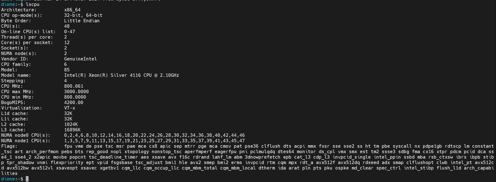
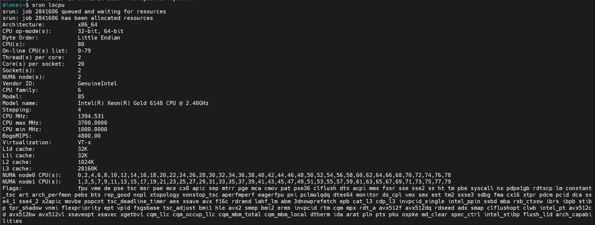

## Exercise 1  
  
### Step 1 & 2  
I have actually already done the application process for a credential on dione last year ( so as my group mates Li Qing and Javier ) because we attended Jans's GPU programming course.
  
Then I run `hostname` by typing in terminal and by submitting via `srun`, and I got the results like this:  
  
First of all when I run `hostname` it just returned `dione.utu.fi`, it probably means that I'm running this command on the login node, and when I did `srun hostname` it gave me `di33`, which should be the host name of the node that is running the task.  
Then try running on different 3 threads, first on the same node then on different nodes:  
  
when given the param for 1 thread per node, there would be 3 different hostnames should be the names for each node that ran the command.  

### Step 3  
Here's what I got from the command `lscpu` directly typed in on dione's terminal, which should be the "login node":  
  
So at least on the node that I have access to via my account, there are:
1. 2 sockets;  
2. 12 cores per socket, which is 24 cores in total;  
3. 2 threads per core, which is 48 threads in total;
4. `CPU MHz:               800.061` means this is the current operating frequency of the CPU, and `CPU max MHz:           3000.0000` means the maximum clock frequency the CPU can run at, which is 3000.0000 MHz (or 3.0 GHz).  
  
Running `lscpu` with srun on the compute node gave me these results:  
  
Which means on compute node there are:
1. 2 sockets;  
2. 20 cores per socket, which is 40 cores in total;  
3. 2 threads per core, which is 80 threads in total;
4. `CPU MHz:               1394.531` means this is the current operating frequency of the CPU, and `CPU max MHz:           7000.0000` means the maximum clock frequency the CPU can run at, which is 3700.0000 MHz (or 3.7 GHz). This is way more powerful than the login node.    

### Step 4   
  
Here's the info of my laptop:  
  
   
  
### Step 5  
  
The matrix multiplication is straght forward: 
  
```c
void matrixmult(double **A, double **B, double **C, const int N) {
  /* Fill in the code here */
  int i, j, k;
  for (i = 0; i < N; i++) {
    for (j = 0; j < N; j++) {
      C[i][j] = 0.0; // Initialize the element to zero
      for (k = 0; k < N; k++) {
        C[i][j] += A[i][k] * B[k][j];
      }
    }
  }
}
```  
```java
public static double [][] matrixmult(double [][]A, double [][]B) {
	  /* Fill in the code here */
	  int N=A.length;
	  double [][]C = new double[N][N];
  
	  for (int i = 0; i < N; i++) {
          for (int j = 0; j < N; j++) {
              for (int k = 0; k < N; k++) {
                  C[i][j] += A[i][k] * B[k][j];
              }
          }
      }
	  
	  return C;
    }
```  

Uploaded the files with SSH and load the modules:  
  
  
Then I submitted the running tasks of the programs with the size 2000*2000, and then got the results:  
  

For the C program I'm comparing the execution time for input size 1000\*1000, 2000\*2000, 3000\*3000 and 4000\*4000, with and without `-O3` flag:  
   
  
|Size\Time |	with -O3 | 	withou -O3 |  
| --- | --- | --- |   
| 1000*1000	| 1.28	 | 4.88 |
| 2000*2000 |	12.37	| 45 |
| 3000*3000 |	52.98	| 191.21 |
| 4000*4000 |	204.79	| 808.48 |

  

### Step 6  
I belive the significant operation of floating point numbers is this multiplication:  
```c
C[i][j] += A[i][k] * B[k][j];
```
which means it would be performed:  
$$Count = 2 \times N \times N \times N = 2N^3 = O(N^3)$$  
where $N$ is the dimension of the matrix (the input). It's pretty bad for matrix mutiplication, there seem to be a whole bunch of methods to optimize it, for example computing each cell in matrix C with a thread, vectorization and some better algorithms for matrix multiplications.