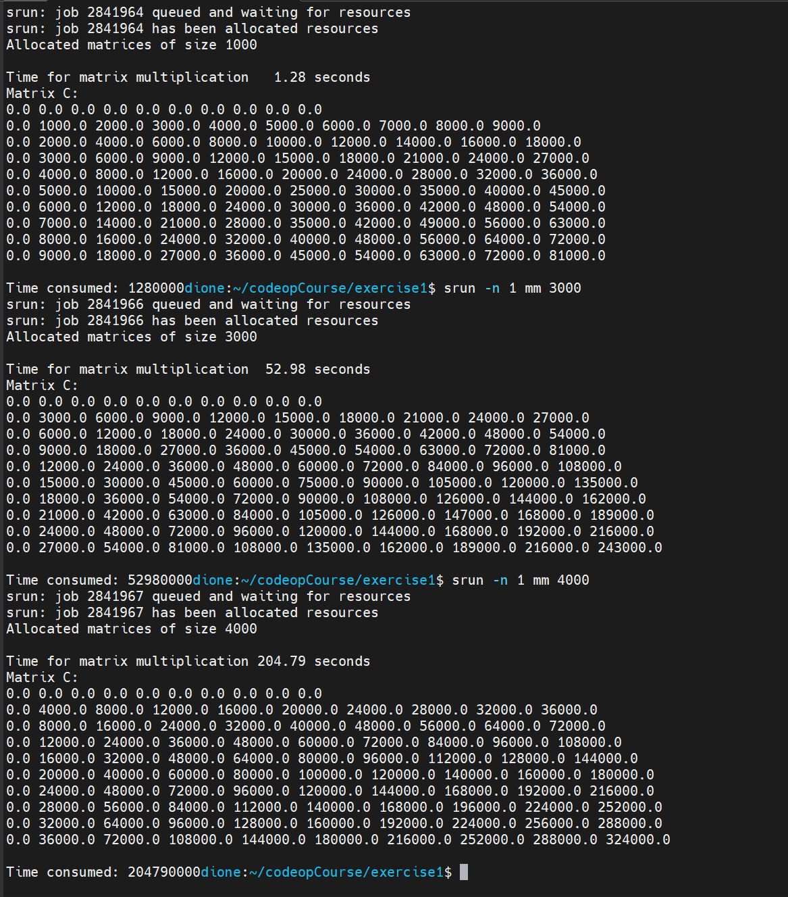
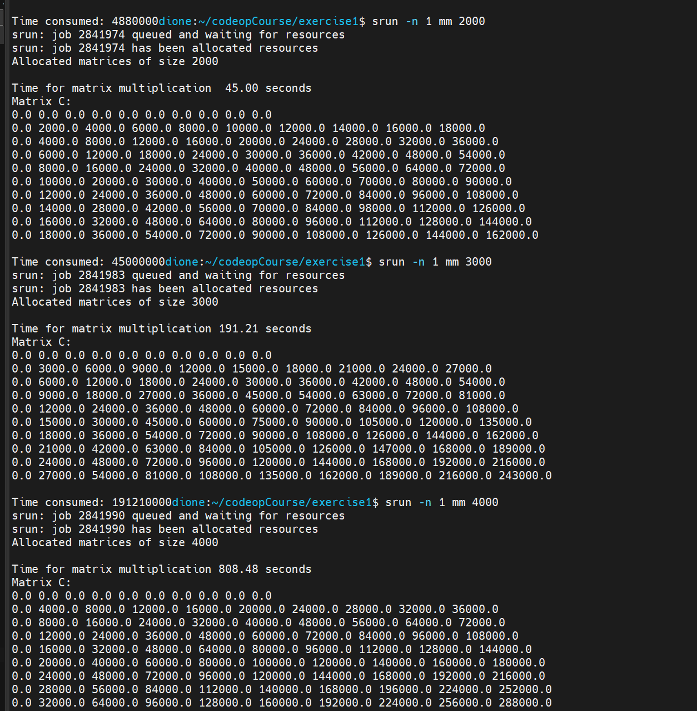
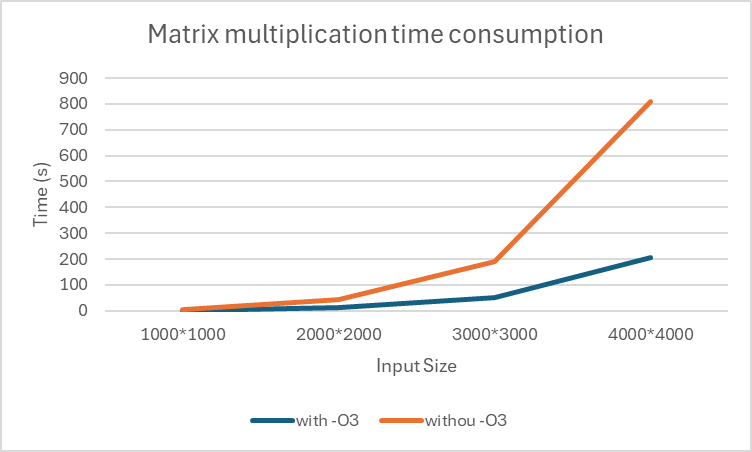

## Weekly report 1   
This week's task is to get familiar with dione's environment. I learned about the difference between login and compute node (mainly the number of threads, sockets and frequency of the cpus, which I didn't pay much attention to in the previous GPU programming course that also used dione).  
  
And more importantly, learning the difference between compiling C programs with and without `-O` is also helpful to understand how much improvement it would make to compile with optimizations. It's easy to visualize with diagrams:  
For the C program I'm comparing the execution time for input size 1000\*1000, 2000\*2000, 3000\*3000 and 4000\*4000, with and without `-O3` flag:  
   
  
|Size\Time |	with -O3 | 	withou -O3 |  
| --- | --- | --- |   
| 1000*1000	| 1.28	 | 4.88 |
| 2000*2000 |	12.37	| 45 |
| 3000*3000 |	52.98	| 191.21 |
| 4000*4000 |	204.79	| 808.48 |

  

I totally missed out the curve for the Java implementation's timing, but according to the following lecture the Java program's performance is not worse than the C implementation with optimizations by a lot, which is kind of surprising since I though it would have been slow.  

For the amount of floating point operation at first I thought it would be like:
   
```c
C[i][j] += A[i][k] * B[k][j];
```
> which means it would be performed:  
> $$Count = N \times N \times N = N^3 = O(N^3)$$  
> where $N$ is the dimension of the matrix (the input). It's pretty bad for matrix mutiplication, there seem to be a whole bunch of methods to optimize it, for example computing each cell in matrix C with a thread, vectorization and some better algorithms for matrix multiplications.  

But actually the `+=` is also doing adding of floating points, so it should be like:  
$$Count = 2 \times N \times N \times N = 2N^3 = O(N^3)$$