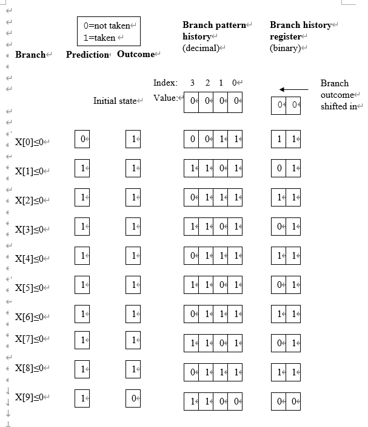
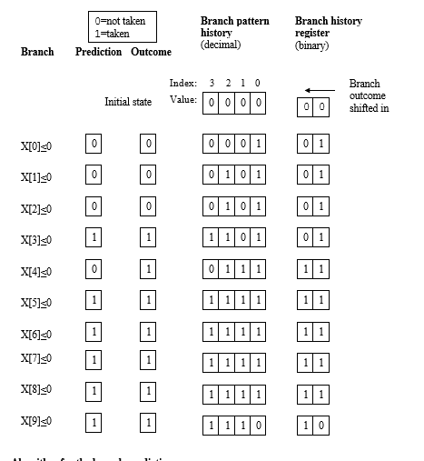
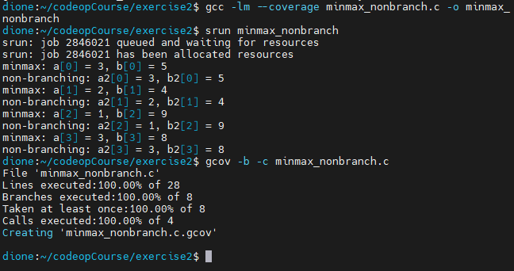

## Exercise 1  
  
### Step 1  
I compiled and run the mm.c (with 2000 as input) from exercise 1 using `--coverage` as the example, I found the output in the `mm.c.gcov` file:  
```c
        -:   71:/*
        -:   72:  Multiply the matrices A and B and place the result in C.
        -:   73:  The matrices are assumed to be square of size N*N
        -:   74:*/
function matrixmult called 1 returned 100% blocks executed 100%
        1:   75:void matrixmult(double **A, double **B, double **C, const int N) {
        -:   76:  /* Fill in the code here */
        -:   77:  int i, j, k;
     2001:   78:  for (i = 0; i < N; i++) {
branch  0 taken 2000
branch  1 taken 1 (fallthrough)
  4002000:   79:    for (j = 0; j < N; j++) {
branch  0 taken 4000000
branch  1 taken 2000 (fallthrough)
  4000000:   80:      C[i][j] = 0.0; // Initialize the element to zero
8004000000:   81:      for (k = 0; k < N; k++) {
branch  0 taken 8000000000
branch  1 taken 4000000 (fallthrough)
8000000000:   82:        C[i][j] += A[i][k] * B[k][j];
        -:   83:      }
        -:   84:    }
        -:   85:  }
        1:   86:}
        -:   87:
        -:   88:
```
The for loop could be considered to contain 2 branches, one of them is the loop body executed when the 2nd expression(like `i < N`, `j < N` and `k < N`) in the for statement is fulfilled ( here it's called `branch 0` ) and a "fallthrough" branch which is jumping out of the loop when the 2nd expression evalues to false. And `C[i][j] += A[i][k] * B[k][j];` in the inner loop which perform the floating point calculation was executed $2000 \times 2000 \times 2000 = 8000000000$ times.  

### Step 2  
If we assume the compiler implemented the if-statement with `x[i] <= 0`, then for array a (-1, 2, -3, 4, -5, 6, -7, 8, -9, 10), I think the form would look like this:  
  
and for array b (1, 2, 3, 4, -5, -6, -7, -8, -9, -10), the form would be like:  
  
  
### Step 3  
I compiled and tested both the branching and non-branching min-max function: 
  
Here's my implementation, as well as the coverage infomation:  
```c
function minmax called 1 returned 100% blocks executed 100%
        1:    3:void minmax(int a[], int b[], int n) {
        5:    4:    for (int i = 0; i < n; i++) {
branch  0 taken 4
branch  1 taken 1 (fallthrough)
        4:    5:        if (a[i] > b[i]) {
branch  0 taken 2 (fallthrough)
branch  1 taken 2
        2:    6:            int tmp = a[i];
        2:    7:            a[i] = b[i];
        2:    8:            b[i] = tmp;
        -:    9:        }
        -:   10:    }
        1:   11:}
        -:   12:
        -:   13:
function minmax_non_branching called 1 returned 100% blocks executed 100%
        1:   14:void minmax_non_branching(int a[], int b[], int n) {
        5:   15:    for (int i = 0; i < n; i++) {
branch  0 taken 4
branch  1 taken 1 (fallthrough)
        4:   16:        int diff = a[i] - b[i];
        -:   17:        
        -:   18:        // Create a mask based on the sign of the difference
        4:   19:        int mask = diff >> (sizeof(int) * 8 - 1);
        -:   20:        
        -:   21:        // If a[i] > b[i], diff will be positive, mask will be 0
        -:   22:        // If a[i] <= b[i], diff will be negative, mask will be -1
        -:   23:
        -:   24:        // Apply the mask to swap the values if needed without branching
        4:   25:        int min = b[i] + (diff & mask);
        4:   26:        int max = a[i] - (diff & mask);
        -:   27:        
        4:   28:        a[i] = min;
        4:   29:        b[i] = max;
        -:   30:    }
        1:   31:}
        -:   32:
function main called 1 returned 100% blocks executed 100%
        1:   33:int main() {
        1:   34:    int a[] = {5, 2, 9, 3};
        1:   35:    int b[] = {3, 4, 1, 8};
        1:   36:    int n = sizeof(a) / sizeof(a[0]);
        -:   37:
        1:   38:    minmax(a, b, n);
call    0 returned 1
        -:   39:
        1:   40:    int a2[] = {5, 2, 9, 3};
        1:   41:    int b2[] = {3, 4, 1, 8};
        -:   42:
        1:   43:    minmax_non_branching(a2, b2, n);
call    0 returned 1
        -:   44:
        5:   45:    for (int i = 0; i < n; i++) {
branch  0 taken 4
branch  1 taken 1 (fallthrough)
        4:   46:        printf("minmax: a[%d] = %d, b[%d] = %d\n", i, a[i], i, b[i]);
call    0 returned 4
        4:   47:        printf("non-branching: a2[%d] = %d, b2[%d] = %d\n", i, a2[i], i, b2[i]);
call    0 returned 4
        -:   48:    }
        -:   49:
        1:   50:    return 0;
        -:   51:}
```
Basically, what `if (a[i] > b[i])` do is doing a subtraction and decide whether the program needs to jumb to the beginning point of the branch with some operation like `jle` (jump when the subtraction result less or equal to zero), and in the if-body it's simple swapping `a[i]` and `b[i]`, therefore it would be fine to just replace it with masking to get the min and max value.  
  
### Step 4  
  
> a) How many stages does the pipeline have?  

The pipeline of the Intel Skylake microarchitecture has *14-19 stages*.

> b) How many physical registers does the register renaming mechanism use?  

The register renaming mechanism uses *180 physical registers*.

> c) How many reservation stations does it have?  

The Intel Skylake microarchitecture has *two reservation stations*.

> d) How large are the load- and store-buffers?  

The sizes of the load- and store-buffers are *72 and 56 entries* respectively.
