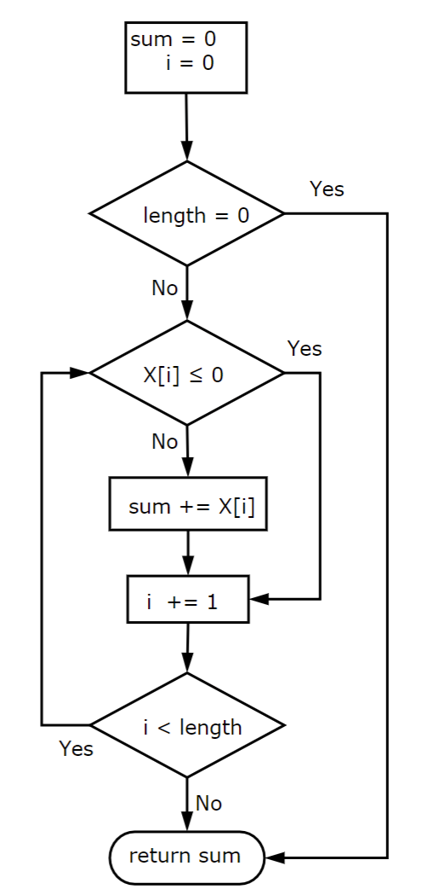

## Weekly report 2   
This week we're learning about the branch prediction and some basics about CPU instruction pipelines.   
  
The `gcov` is a pretty handy tool when I'm going to calculate the branch calls if I'm buiding C/C++ programs that I learned from this week's tutorials, for example:
```c
        -:   71:/*
        -:   72:  Multiply the matrices A and B and place the result in C.
        -:   73:  The matrices are assumed to be square of size N*N
        -:   74:*/
function matrixmult called 1 returned 100% blocks executed 100%
        1:   75:void matrixmult(double **A, double **B, double **C, const int N) {
        -:   76:  /* Fill in the code here */
        -:   77:  int i, j, k;
     2001:   78:  for (i = 0; i < N; i++) {
branch  0 taken 2000
branch  1 taken 1 (fallthrough)
  4002000:   79:    for (j = 0; j < N; j++) {
branch  0 taken 4000000
branch  1 taken 2000 (fallthrough)
  4000000:   80:      C[i][j] = 0.0; // Initialize the element to zero
8004000000:   81:      for (k = 0; k < N; k++) {
branch  0 taken 8000000000
branch  1 taken 4000000 (fallthrough)
8000000000:   82:        C[i][j] += A[i][k] * B[k][j];
        -:   83:      }
        -:   84:    }
        -:   85:  }
        1:   86:}
        -:   87:
        -:   88:
```
The for loop could be considered to contain 2 branches, one of them is the loop body executed when the 2nd expression(like `i < N`, `j < N` and `k < N`) in the for statement is fulfilled ( here it's called `branch 0` ) and a "fallthrough" branch which is jumping out of the loop when the 2nd expression evalues to false. And `C[i][j] += A[i][k] * B[k][j];` in the inner loop which perform the floating point calculation was executed $2000 \times 2000 \times 2000 = 8000000000$ times.  
One of the interesting thing in the model solution is that if we're replacing the `if` statement by using the conditional operator `?:`, seems like it would not generate a branched version of the compiled code without having to figure out how to do the same with bit manipulations:
```c
min = a[i] > b[i] ? b[i] : a[i];
max = a[i] < b[i] ? b[i] : a[i];
```  
Which is kind of suprising because I thought under the hood the compiler would just handle it like an if statement.... 
And it's also good to review about how branches are usually compiled, from my previous experience with assembly code on x86 platforms, there are certain operations like `jeq` and `jle`, which means jump(update the PC register to the value of the symbol following this command, could happen in branching or process calls), and just like the flowchart, sometimes the compiled machine code is not always implementing the whole brancing process the same way we describe in the source code:  
  