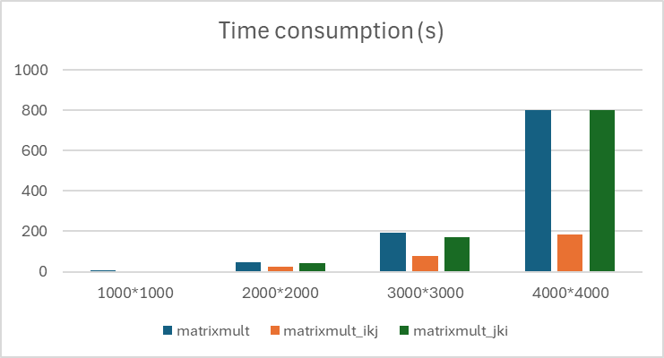

## Exercise 3  
  
### Step 1  
#### a. calculate the cache miss  
For the (i, k, j) loop: it accesses `a[i][k]` once per iteration of the `k` loop, and it is stored in a register. Since we access this matrix row-wise, we have a cache miss every 8 iterations (one cache miss per cache line). It accesses `b[k][j]` sequentially within the innermost loop `j`. Therefore, we get a cache miss every 8 iterations as we're accessing it row-wise, which is cache-friendly in a row-major layout. So it's `0.125 misses per innermost loop`.

And for the (j, k, i) loop, it accesses `a[i][k]` once per iteration of the `i` loop, so `1 miss per innermost loop.`  
  
#### b. Implement and record time
Running the implementations on dione gave me the following results:  
```bash
Allocated matrices of size 1000

Time for matrix multiplication   1.34 seconds
Time for matrix multiplication_ikj   0.35 seconds
Time for matrix multiplication_ikj   1.48 seconds
###
Allocated matrices of size 2000

Time for matrix multiplication  12.17 seconds
Time for matrix multiplication_ikj   4.19 seconds
Time for matrix multiplication_ikj  15.97 seconds
###
Allocated matrices of size 3000

Time for matrix multiplication  52.74 seconds
Time for matrix multiplication_ikj  17.28 seconds
Time for matrix multiplication_ikj  60.58 seconds
###
Allocated matrices of size 4000

Time for matrix multiplication 207.09 seconds
Time for matrix multiplication_ikj  41.06 seconds
Time for matrix multiplication_ikj 338.97 seconds
```
Which is:  
|Implementation\input size |	matrixmult | 	matrixmult_ikj |  matrixmult_jki | 
| --- | --- | --- |   --- | 
| 1000*1000	| 4.9	 | 2.85 | 4.13 |
| 2000*2000 |	45.33	| 22.96 | 43.12 |
| 3000*3000 |	191.06	| 78.41 | 168.94 |
| 4000*4000 |	802.24	| 186.22 | 801.8 |  
  
This was compiled without any optimization flags.  
  
  

#### c. explain
So `matrixmult_ikj` does seems to be faster, roughly speaking only takes around 1/4 to 1/3 of the running time, matches the estimation (due to fewer cache miss).  
But somehow, when I compile with optimization flag `-O3` the `matrixmult_ikj` become slower than the `matrixmult` one.    
  
  

### Step 2
Since in our code double precision floating point numbers are used, the size of each matrix element is 8 bytes, to calculate the block size for level 1 cache, we can use the formula:

$$block_size = L1 cache size / (number of cache lines * element size)$$

The number of cache lines in level 1 cache is typically 64 (guessing), so:  
  
$$block_size = 32 KB / (64 * 8 B) = 512B$$
  
To calculate the block size for L2 cache, we just use the same formula, but with the size of L2 cache:

$$block_size = 1024 KB / (64 * 8 B) = 2048 B$$

When I run it, they took 317.21 and 325.14 seconds.  

  