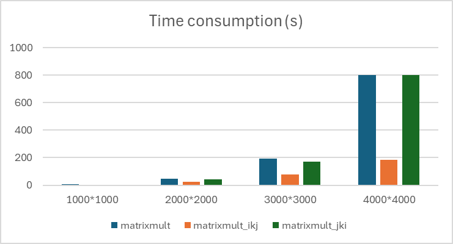

## Weekly report 3  
  
This week we focused on cache miss and blocking in matrix multiplication. In task 1 I tried to calculate the cache miss count like this:  
> For the (i, k, j) loop: it accesses `a[i][k]` once per iteration of the `k` loop, and it is stored in a register. Since we access this matrix row-wise, we have a cache miss every 8 iterations (one cache miss per cache line). It accesses `b[k][j]` sequentially within the innermost loop `j`. Therefore, we get a cache miss every 8 iterations as we're accessing it row-wise, which is cache-friendly in a row-major layout. So it's `0.125 misses per innermost loop`.   
And for the (j, k, i) loop, it accesses `a[i][k]` once per iteration of the `i` loop, so `1 miss per innermost loop.`  
  
In (i, k, j) loop both b and c are done in row order with 1 miss per 8 iterations, so it should be $0.125 + 0.125 = 0.25$ misses per iteration. Same for (j, k, i) loop I was also only counting matrix a and got 1 miss per iteration, and it should be 2.    
I also implemented these different approaches without the optimization flag `-O*`:  
|Implementation\input size |	matrixmult | 	matrixmult_ikj |  matrixmult_jki | 
| --- | --- | --- |   --- | 
| 1000*1000	| 4.9	 | 2.85 | 4.13 |
| 2000*2000 |	45.33	| 22.96 | 43.12 |
| 3000*3000 |	191.06	| 78.41 | 168.94 |
| 4000*4000 |	802.24	| 186.22 | 801.8 |  
  
  
  
For using the cache by choosing block size, I think I got it completely wrong. Since our purpose is to use the L1 or L2 cache to calculate a small patition/block of the matrices, what I should have calculate is a size of this block ( the `width` or the `length` of the block matrix, usually the same for simplicity because we're using a square matrix ) that fits into the cache completely.  
For example, L2 cache has a size of 1024 KB, so it can hold at most 128K (=128*1024) double values (8 Bytes each), and if we want to store both A and B's block in it, then each block only get 64kB's storage in the L2 cache, so the block size (the `width` or `length` of the block) is the square root 256.  
  
For task 3 we're supposed to combine blocking and the loop order that introduces less cache misses, in this case it should be the **(i, k, j) loop**.