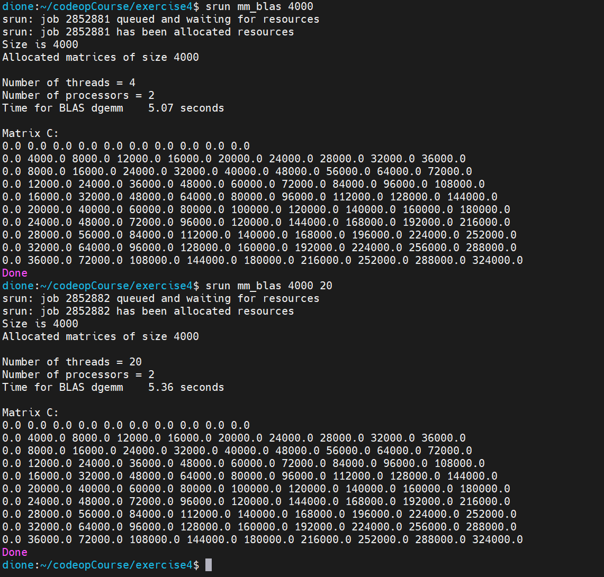
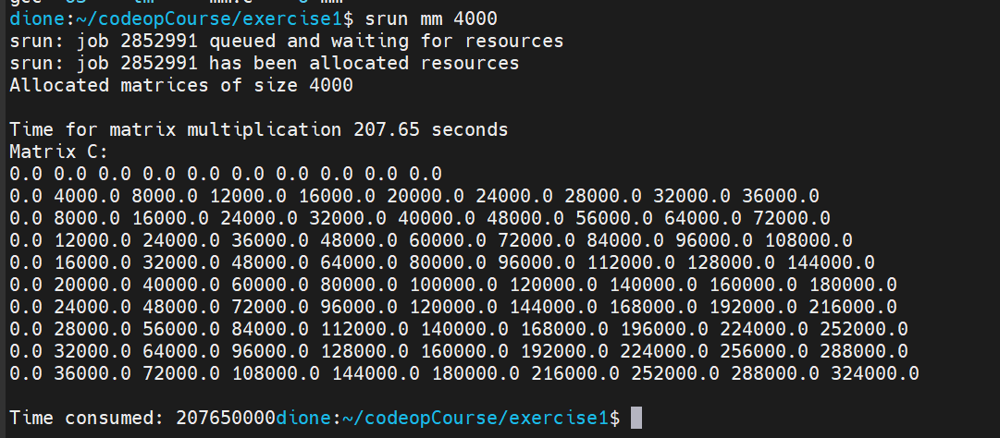

## Exercise 4  
  
### Step 1  
Fill in the non-negative numbers that can be represented with a 6-bit floating-point format based on the IEEE standard in the table below. The 6-bit format uses 3 exponent bits and 2 significand bits, and one sign bit. Since the exponent is 3 bits, the bias is 23-1-1 = 3.  
  
  
  
### Step 2  
The value **-275.875** as a 32-bit floating-point number using the **IEEE 754 standard** would be like this:  

1. **Sign Bit**: Determine the sign bit based on whether the number is positive or negative. Since **-275.875** is negative, the sign bit will be **1**.  
2. **Binary Representation of Absolute Value**:  
   - Convert the absolute value of **275.875** to binary. The integer part is **275**, which is **100010011** in binary.  
   - The fractional part is **0.875**. To convert it to binary, multiply it by 2 repeatedly:  
     - **0.875 × 2 = 1.75** (integer part: **1**, fractional part: **0.75**)  
     - **0.75 × 2 = 1.5** (integer part: **1**, fractional part: **0.5**)  
     - **0.5 × 2 = 1.0** (integer part: **1**, fractional part: **0**)
   - Combine the integer and fractional parts: **0.111** (binary).  
3. **Exponent Calculation**:  
   - The normalized form of **275.875** is **1.0001011 × 2^8** (since we shifted the decimal point 8 places to the left).
   - The biased exponent is calculated as **8 + 127 = 135** (add 127 to the actual exponent).  
4. **Mantissa**:  
   - The normalized mantissa is **00010110000000000000000** (23 bits after the binary point).    
5. **Combine Components**:  
   - The 32-bit representation:  
     - Sign bit: **1** (negative)  
     - Biased exponent: **135** (in binary: **10000111**)  
     - Mantissa: **00010110000000000000000**  
6. **Final IEEE 754 Representation**:  
   - Combine the sign bit, biased exponent, and mantissa:  
     - **1 10000111 00010110000000000000000**  
7. **Hexadecimal Representation**:  
   - Convert the entire 32-bit binary representation to hexadecimal:  
     - **11000011100010110000000000000000**  
     - In hexadecimal: **CF16B000**  
  
Therefore, the 32-bit IEEE 754 representation of **-275.875** is **CF16B000** in hexadecimal format.
  
### Step 3  
In the IEEE 754 standard for single-precision floating-point format (often denoted as FP32 or float32), a 32-bit representation is used to store numeric values.  
  
To find the smallest single-precision floating-point value X.0 for which $X + 1.0f = X$ , we need to consider the limitations of this format. Here are some key points:  
1. Smallest Positive Normalized Value:  
    - The smallest positive normalized value in single-precision floating-point format has an exponent of 126 and a mantissa of 1.0 (since the leading bit is implicit).  
    - The value can be expressed as: `1.0 × 2^(-126)` .  
2. Next Representable Value:  
    - The next representable value after X.0 is obtained by adding `2^(-23)` to `X.0`
    - Therefore, the next representable value is `X.0 + 2^(-23)`  
3. Condition for `X + 1.0f = X` :  
    - To find the smallest X.0 , we need to set `X.0 + 2^(-23)` equal to `X.0`:
    ```  
     X.0 + 2^(-23) = X.0
     2^(-23) = 0
    ```  
    - Solving for `X.0` , we get `X.0 = 0` .
  
Therefore, the smallest single-precision floating-point value `X.0` for which `X + 1.0f = X` is simply `0.0` .

### Step 4  
Executing the program generated the following results:
```
sum1 = 1.000000119209290, sum2 = 1.000000000000000, sum3 = 1.000000014901161
```
For sum1, it's simply adding the float literal `0.1f` for 10 times, however due to the computer use the IEEE 754 standard for single-precision floating-point format, each addition can introduce a rounding error. These errors accumulate over the course of multiple additions, leading to a final result that deviates from the ideal value.  
Sum2 was generated by 1 multiplication, since this operation involves only one computation, the rounding error is relatively minimal, hence the result is closer to the expected value.  
I got sum3 by multiplying `0.1f` to a double `10.0`. The double type has higher precision than float, so in theory, this calculation should be closer to the exact result. However, since the initial value of 0.1 has already lost precision, the result still exhibits a slight error.  
  
### Step 5  
  
I executed the program with 4 threads (default) and also 20 threads:  
  
  
To compared to the previous results with -O3, I compiled and run the program in exercise 1 with `-O3`:  
  
So the improvement is huge, almost 40 times faster.  
Then because we are doing:
$$ 4000  \times 4000  \times  4000  \times 2 = 128,000,000,000 $$  
floating point operations (multiplication and adding), it would be:  
$$ 128,000,000,000 / 5 = 25,600,000,000 $$  
floating point ooperations per second.  