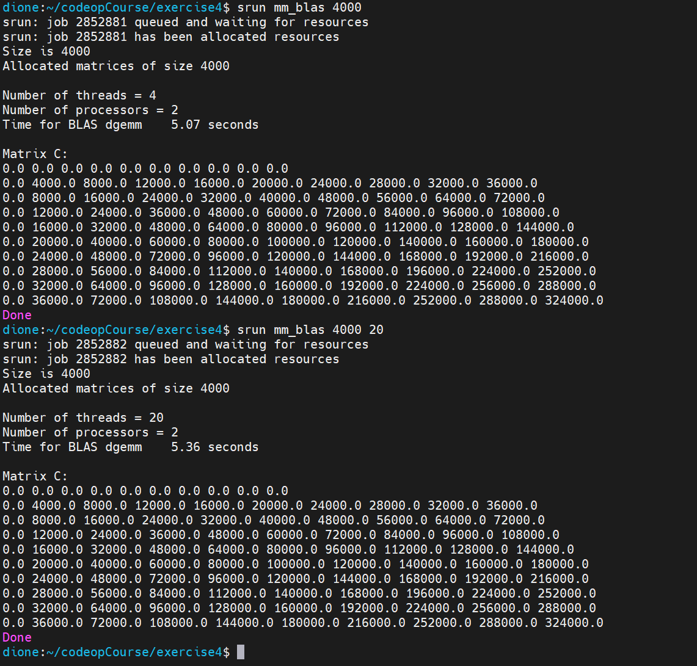
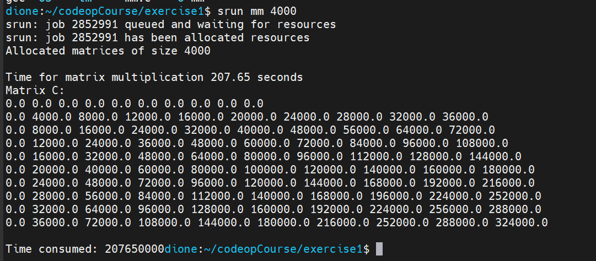

## Weekly report 4  
  
This week's topic is all related to IEEE 754 floating point standard.  
In quetion 1's answer of our weekly assignment, we got the floating point values that are less than 1 completely wrong, because the process of getting the significated value wasn't correct at all so there's no way we could figure out the correct point possition of the value.  

Question 2 is straight forward, the right way of doing it is figure out the binary representation of the absolute value after determining the sign bit, then combine them with the correct exponent. 
  
Question 4 was about the error accumulation in floating point calculations. For sum1, it's simply adding the float literal `0.1f` for 10 times, however due to the computer use the IEEE 754 standard for single-precision floating-point format, each addition can introduce a rounding error. These errors accumulate over the course of multiple additions, leading to a final result that deviates from the ideal value.  
Sum2 was generated by 1 multiplication, since this operation involves only one computation, the rounding error is relatively minimal, hence the result is closer to the expected value.  This is extremely important because we're dealing with floating point numbers in many senarios, for example in scientific calculations, simulations and game engines, if the error sum up it would cause all sorts of unexpected behaviors.   
  
I was doing the calculations by comparing different execution time of the program in step 5, I executed the program with 4 threads (default) and also 20 threads:  
  
  
To compared to the previous results with -O3, I compiled and run the program in exercise 1 with `-O3`:  
  
So the improvement is huge, almost 40 times faster.  
Then because we are doing:
$$ 4000  \times 4000  \times  4000  \times 2 = 128,000,000,000 $$  
floating point operations (multiplication and adding), it would be:  
$$ 128,000,000,000 / 5 = 25,600,000,000 $$  